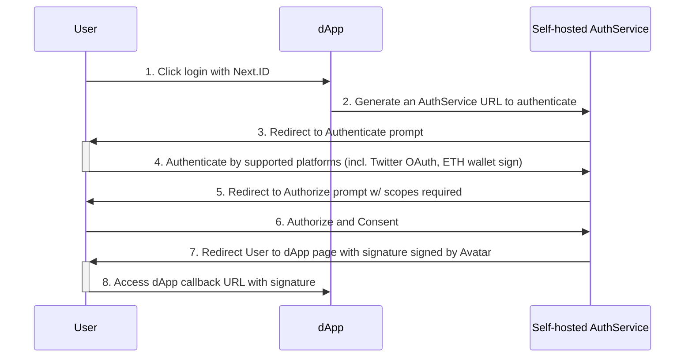

## Sequence

### Auth with 3rd party

### How AuthService authenticate you?

When performing an authorization process, AuthService will send a request to [ProofService](ps-intro) to find if the authenticated identity on a 3rd party platform (e.g. Twitter ID) is bound to a Next.ID Avatar pre-configured on this AuthService.

If found, AuthService will generate a signature signed by a subkey derived from the Avatar and then redirect user to the dApp callback URL with the signature.

#### Authenticate with [supported platforms](as-intro#supported-platforms)

Supported platforms are pre-configured on self-hosted AuthService. For example, if user wants to authenticate with Twitter later, it needs to configure Twitter OAuth client ID and client secret.

#### Subkey generation

AuthService stores subkey in configuration instead of Avatar to protect the private key. The subkey needs to be signed by Avatar with format in eth_sign method: `Subkey certification signature: ${subkey_public_key_hex}`.

Check [helper script](https://github.com/nextdotid/auth_server/blob/main/build/generate_subkey.py) for more information.

### dApp callback

After user redirected to the dApp callback URL, dApp needs to verify the signature. If the signature is valid, dApp can trust the authenticated identity.

#### Parameters

1. `avatar` (string, required): Avatar public key hex string.
2. `expired_at` (string, required): UNIX timestamp.
3. `state` (string, required): State string passed from dApp.
4. `subkey` (string, required): Subkey public key hex string.
5. `subkey_cert_sig` (string, required): Subkey certification signature signed by Avatar, encoded in Base58.
6. `sig` (string, required): Signature of `avatar=${avatar}\nredirect_uri={redirect_uri}\nexpired_at=${expired_at}\nstate=${state}` singed by Subkey, encoded in Base58.
