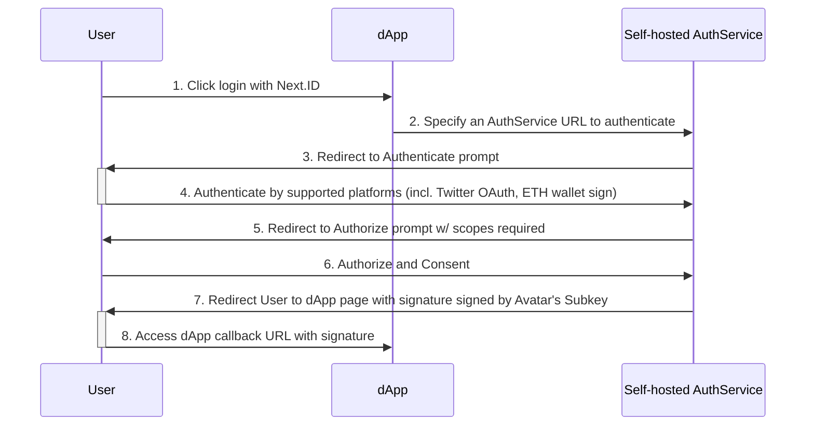

As we already built up the connection between avatar and [other identities](core-concepts/proof-service/ps-intro#supported-platform). The idea of letting DApps have its own version of "Sign-in with Google/Twitter" came out naturally. Auth Service is designed to help DApps realize this capability.

## How it works

### Workflow of Auth with 3rd party platform 



When a DApp initiates an authorization process, it must specify an `AuthService` instance (We strongly recommend to self-host one) to carry out the authentication. (step 2)

`AuthService` begins by authenticating the identity using third-party platforms (e.g., Twitter ID). 
Once authenticated, `AuthService` queries the [ProofService](./ps-intro) to check the binding avatar result of this identity. (step 3-4)

If the authenticated identity is associated with an Avatar, and this Avatar aligns with one of the pre-configured Avatars in `AuthService`, then `AuthService` grants the DApp permission to use the Avatar as its identity for a set experimental duration. (step 5-6)

This authorization is confirmed by signing a message. Instead of using the Avatar itself for this purpose, we introduce a 'subkey' to sign the message (this will be elaborated further in subsequent sections)(step 7).

The process concludes by redirecting to the DApp with the following parameters(step 8):
1. `avatar` (string, required): Avatar public key hex string.
2. `expired_at` (string, required): UNIX timestamp.
3. `state` (string, required): State string passed from dApp.
4. `subkey` (string, required): Subkey public key hex string.
5. `subkey_cert_sig` (string, required): Subkey certification signature signed by Avatar, encoded in Base58.
6. `sig` (string, required): Signature of `avatar=${avatar}\nredirect_uri={redirect_uri}\nexpired_at=${expired_at}\nstate=${state}` singed by Subkey, encoded in Base58.

### Configuration 
Understanding how it operates, the preliminary step before launching an instance of `Auth Service` is to prepare a configuration file.There are three parts. 

#### The Avatar and a subkey that is signed by the avatar:
In the configuration, the list of avatars represents the identity that can be authenticated by this instance of `AuthService`. The private key is used to sign ta message, proving the ownership of the avatar. We strongly recommend using a subkey that is signed by the avatar instead of the avatar itself in the configuration. For enhanced security, it's advisable to generate a unique subkey for specific cases. This not only tailors the security to the situation but also minimizes the risk of exposing the avatar's private key.

Run the following command with [generate_subkey.py](https://github.com/nextdotid/auth_server/blob/develop/build/generate_subkey.py) to generate a new subkey and sign it with your Avatar private key:

```bash
pip install base58 eth_keys # skip if installed
python ./build/generate_subkey.py
```

Subkey is randomly generated so that you can regenerate and use a new subkey at any time.

#### OAuth Service configuration
In order to use the Oauth Service of Twitter/Discord/..., configurations like the following are necessary to be pre-configured in the AuthService (the platform depends on you, only need to put the configurations that you want to support).

#### ProofService Endpoint
The endpoint of `ProofService` is configured to allow AuthService to retrieve the connections between the avatar and other identities.

The example of the whole configuration:

```json
{
  "Avatars": [
      {
        "Avatar": "avatar-public-key",
        "Subkey": {
          "PrivateKey": "the-private-key-that-signed-by-avatar",
          "CertificationSignature": "signature-that-signed-by-avatar"
        }
      }
  ],
  "Proof": {
    "Endpoint": "https://proof-service.nextnext.id/"
  },
  "Discord": {
    "ClientID": "123456789012345678",
    "ClientSecret": "123456789012345678"
  },
  "Twitter": {
    "ClientID": "aBcDEFG...",
    "ClientSecret": "Hij123456..."
  }
  // ...
}
```

## How to start up an AuthService
After preparing the configuration file, we can run it with docker.
[The auth service source code and instructor on how to run it with docker](https://github.com/NextDotID/auth_server#deployment)

Firstly, build the Docker image:

```bash
docker build -t authserver -f ./src/AuthServer.Server/Dockerfile .
```

Run the following command to run it once, replace `/path/to/appsettings.Production.json` with your own configuration file path.

```bash
docker run --rm -p 80:80 -v /path/to/appsettings.Production.json:/app/appsettings.Production.json authserver
```
