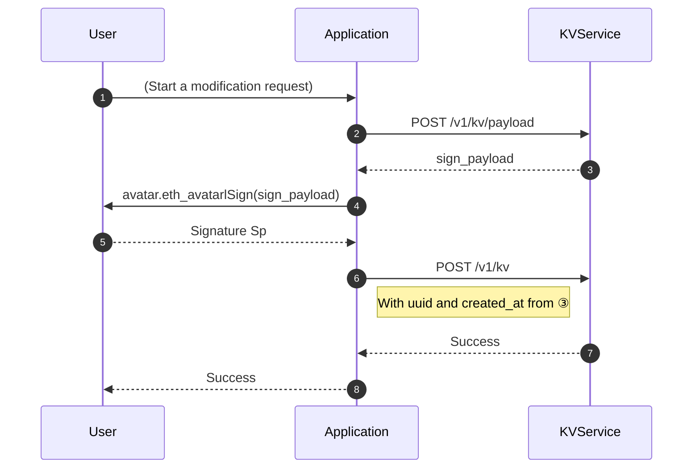

While developing the Next.ID, we found that we still need a place to keep some customized data in some cases. However, placing everything on the blockchain wasn't a reasonable choice. This led us to create the KV service as a user-friendly tool for storing some customized data. Through cryptographic verification, the `KV Service` ensures that only the avatar's owner can manage (create and modify) its content, while allowing others to read it.

## How it works 
`KV Service` can store any valid JSON object data. There are serval APIs for reading and writing the data.

### Work Flow for writing 


The generation signature and verification steps to guarantee the modification request is from the owner of Avatar.

### Query data
After writing the data, everyone can get it via API.See [GET /v1/kv](/rest-api/kvservice-api#query).


### Design
- Each user has `1 + N` namespaces：
  - [Avatar](/introduction/how-it-works#avatars-in-nextid) itself has a namespace (`platform == "nextid" && identity == "0xAVATAR_PUBLIC_KEY"`)
    - There's no limitation that [Avatar](/introduction/how-it-works#avatars-in-nextid) should be used in [ProofService](ps-intro) once.
  - Each [binding record](./ps-intro#data-structure) (in [ProofService](ps-intro)) of each [Avatar](/introduction/how-it-works#avatars-in-nextid) has a namespace.
    - Value of `platform` and `identity` are the same as [supported platforms](./ps-intro#supported-platform) in ProofService.
- [Query data](/rest-api/kvservice-api#query): public, only need to specify `avatar`.
- [Write data](/rest-api/kvservice-api#payload): A patch followed [RFC 7396](https://www.rfc-editor.org/rfc/rfc7396) standard.

  <details>
  <summary>A glimpse of RFC7396</summary>

  ```js
  // Assume current data is:
  {
    "a": {
      "b": [2, 3, 4, "test"]
    },
    "c": "Hello"
  }

  // If this patch is submitted:
  { "a": { "b": null, "new_key": true }, "c": "KVService" }

  // Then patched data will become:
  {
    "a": {
      "new_key": true
    },
    "c": "KVService"
  }
  // Notice: nested modification of Array value is not supported.
  //         Replace the whole Array with new value instead.
  ```
  </details>

### Notice
- Each app should use its "package name" as its own namespace, to ensure other apps are not infected by your modification.
  > For example, I as a developer, identify my app as `io.mask.web3-profile-plugin`,
  >
  > Then I should make the modifications under `{ "io.mask.web3-profile-plugin": .... }` key.

- Theoretically, there is no size limitation for data. FairUse™️, please.
  > If you want to store data bigger than a string can handle, consider [Arweave](https://www.arweave.org).

## Use Case - as a persistence storage

You can use `KV Service` to store the data that needs cross-session persistence.

For example, you can store the user's avatar, nick name, bio, show/hide status of NFT list, or order of these contents, under your web3 app's scenarios.

Using `KV Service` gives you some benefits:

- The change made by the user is verifiable by other user/applications, aka platform-independent. No one (except the user himself) can change the data without a valid signature.
- The data is stored in a decentralized way, no matter where this data is actually stored. User always has a choice to move their data to other (or self-hosted) platforms.
  > The actual "migration" function is still under development.
