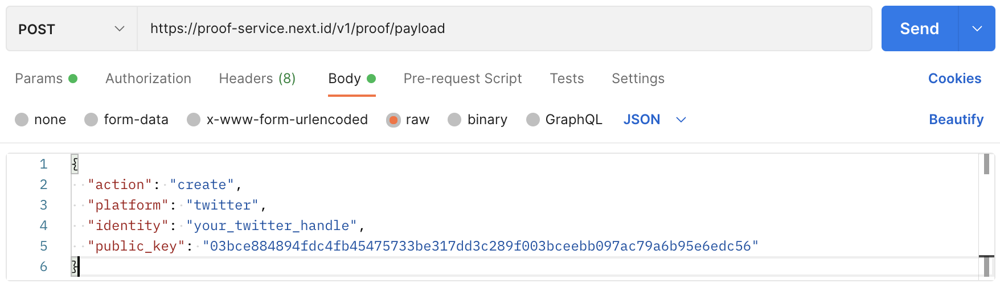
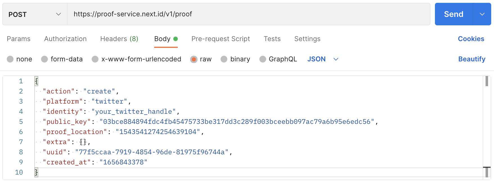

To get you started, let's take one example and walk through a binding process with the most frequently used platform: the Twitter account. Hold tight, let's go!

## Prerequisite
- Basic in Cryptography
- Basic in Python, TypeScript and Node.js
- Basic in Postman or cURL
- Or Using any programming language and required libraries you preferred
- Knowing nothing but still, want to learn? Don't panic, it's okay! In about a few hours you'll get to know it all!

## Set up your first Avatar

In the Crypto world, a cryptographic key pair is what stands as one of your AVATARs. Next.ID uses by far the most secure algorithm to protect your sovereignty: curve secp256k1.

We're showing it by using Python's [secp256k1-py](https://pypi.org/project/secp256k1/).

First to install secp256k1-py lib:

```
// get PIP installed in advance or use your own way
pip install secp256k1
```

Then generate your own private and public key pair:

```
python -m secp256k1 privkey -p

// ATTENTION! We intently replaced the last three digit of private key to be xxx.
// Private key is everything and NEVER expose it to others or publicly
43c25fecc20e6b2a0d86c81a0202d125c0181deb9975d1170d80378c7e05bxxx
Public key: 03bce884894fdc4fb45475733be317dd3c289f003bceebb097ac79a6b95e6edc56
```

Having this one key pair, you now can get to create an Avatar backed by unbreakable cryptography.

## Binding Twitter account

From now on, we're demonstrating the whole process by using a Twitter Handle and key-pair generated as above. Replace all fields to be your own as you go on, you'll get acknowledged when and where you should do it.

Especially `your_twitter_handle` is where you'll be replacing it with your own.

### Get a payload

If We're heading into space, there'll be a Rocket carrying us as a payload. Joining Cyberspace each time is quite similar.

First, let's get the payload needed to represent us. Calling REST API `/proof/payload` by using POSTMAN or using cURL in the command line:



Replace the fields of `identity` and `public_key` to be your own, then it will return like:

```
{
    "post_content": {
        "default": "🎭 Verifying my Twitter ID @your_twitter_handle for @NextDotID.\nSig: %SIG_BASE64%\n\nInstall Mask.io to enhance your Web3 experience.\n",
        "en_US": "🎭 Verifying my Twitter ID @your_twitter_handle for @NextDotID.\nSig: %SIG_BASE64%\n\nInstall Mask.io to enhance your Web3 experience.\n",
        "zh_CN": "🎭 正在通过 @NextDotID 验证我的 Twitter 帐号 @your_twitter_handle 。\nSig: %SIG_BASE64%\n\n请下载安装 Mask.io 去增强您的 Web3 体验。\n"
    },
    "sign_payload": "{\"action\":\"create\",\"created_at\":\"1656843378\",\"identity\":\"your_twitter_handle\",\"platform\":\"twitter\",\"prev\":\"KNyNFtvhlRVJh/oU6RryK2n+C2dja9aLQPjlv5VHMsQErZROojEmMAgmeEQVC094EOuHIYcv3lCYXf8d3zqDCQE=\",\"uuid\":\"77f5ccaa-7919-4854-96de-81975f96744a\"}",
    "uuid": "77f5ccaa-7919-4854-96de-81975f96744a",
    "created_at": "1656843378"
}
```

`sign_payload` is the payload we're looking for. `uuid` and `created_at` are also required for the following steps.

### Generate the signature

With the payload returned, now we can go ahead to sign it. Git clones our [open-source Demo in TypeScript](https://github.com/nextdotid/Signature-Generating-Sample) to accomplish it.

Notice that, you need to set up Node.js and TypeScript before downloading, then go to install the required libs as `ethereumjs-util`.

Let's open up the `index.ts` file under `/src`, and replace the `const message` with the string `sign_payload` in the former step:

```
import { ecsign, toRpcSig, keccakFromString, BN } from 'ethereumjs-util';

async function personalSign(message: Buffer, privateKey: Buffer): Promise<Buffer> {
    const messageHash = keccakFromString(`\x19Ethereum Signed Message:\n${message.length}${message}`, 256)
    const signature = ecsign(messageHash, privateKey)
    return Buffer.from(toRpcSig(signature.v, signature.r, signature.s).slice(2), 'hex')
}

async function main() {
    // this message come from the return attribute "sign_payload" of everytime calling API: v1/proof/payload
    const message = Buffer.from('{\"action\":\"create\",\"created_at\":\"1656843378\",\"identity\":\"your_twitter_handle\",\"platform\":\"twitter\",\"prev\":\"KNyNFtvhlRVJh/oU6RryK2n+C2dja9aLQPjlv5VHMsQErZROojEmMAgmeEQVC094EOuHIYcv3lCYXf8d3zqDCQE=\",\"uuid\":\"353449e6-3a6f-4ac8-ae65-ba14bf466baf\"}', 'utf8');
    // ATTENTION! RUN THIS LOCALLY! NEVER SHARE YOUR PRIVATE KEY WITH ANY OTHERS OR PUBLIC!
    // replace XXX with your own Private Key for generating a signature
    const secretKey = Buffer.from('XXX', 'hex');
    const signature = await personalSign(message, secretKey);

    console.log(`Signature: 0x${signature.toString('hex')}`);
    // For demo ONLY
    // Signature: 0xf72fe6b00be411bd70ffe1b9bf322f18529ea10e9559dd26ba10387544849fc86d712709dfb709efc3dcc0a01b6f6b9ca98bd48fe780d58921f4926c6f2c0b871b

    console.log(`Signature(base64): ${signature.toString('base64')}`);
    // For demo ONLY
    // Signature(base64): 9y/msAvkEb1w/+G5vzIvGFKeoQ6VWd0muhA4dUSEn8htcScJ37cJ78PcwKAbb2ucqYvUj+eA1Ykh9JJsbywLhxs=
}

main();
```

Now we can run it properly. Go to the root directory to compile:

```
➜  Generating-Signature-TypeScript git:(main) tsc
```

Go to the `/disc` directory to get it running:

```
➜  dist git:(main) ✗ node index.js
```

We will get two console.log outputs. One is the Signature(base64) that we're going to use for proof posting on Twitter.

### Post a proof Tweet

Follow the format we get in calling `/proof/payload`, replace the `Sig` with Signature(base64) we just get and visit twitter.com to tweet as below:

```
🎭 Verifying my Twitter ID @your_twitter_handle for @NextDotID.
Sig: 9y/msAvkEb1w/+G5vzIvGFKeoQ6VWd0muhA4dUSEn8htcScJ37cJ78PcwKAbb2ucqYvUj+eA1Ykh9JJsbywLhxs=

Next.ID YOUR DIGITAL IDENTITIES IN ONE PLACE
```

Then go to the detail page of this tweet, get its ID at the end of the URL like `1543541274254639104``:

```
https://twitter.com/your_twitter_handle/status/1543541274254639104
```

This ID will be the `proof_location` we needed for verifying.

### Verify the proof

We're getting close! Calling REST API `/proof` by using POSTMAN or using cURL in the command line:



It will return a code of `201` Created` and empty curly brackets :

```
{}
```

### Check the status of Avatar

All set! Let's go to have a look at our newly created Avatar.

Calling REST API `/proof` in `GET` method and with two fields of `platform` and `identity`:

```
https://proof-service.next.id/v1/proof?platform=twitter&identity=your_twitter_handle
```

We will get as below:

```
{
    "pagination": {
        "total": 4,
        "per": 20,
        "current": 1,
        "next": 0
    },
    "ids": [
        {
            "avatar": "0x03bce884894fdc4fb45475733be317dd3c289f003bceebb097ac79a6b95e6edc56",
            "proofs": [
                {
                    "platform": "twitter",
                    "identity": "your_twitter_handle",
                    "created_at": "1656844114",
                    "last_checked_at": "1656844114",
                    "is_valid": true,
                    "invalid_reason": ""
                }
            ]
        }
    ]
}
```

Now you successfully created an Avatar on-chain as who you're. Go exploring cyberspace ahead!
## Next Step

- View the [architecture] of Next.ID framework(../core-concepts/architecture.md)
- Understand [how it works in detail](../core-concepts/how-it-works.md)