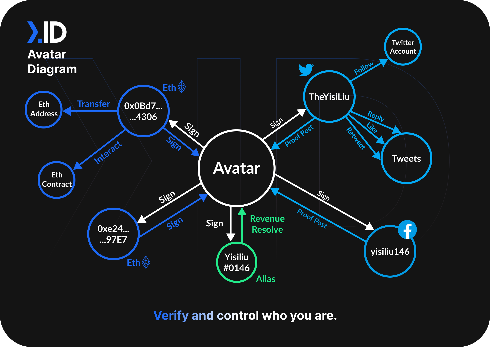
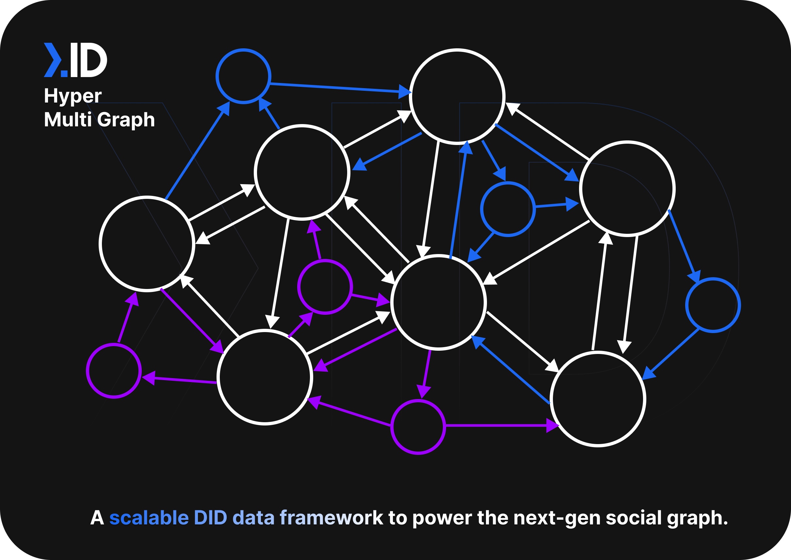
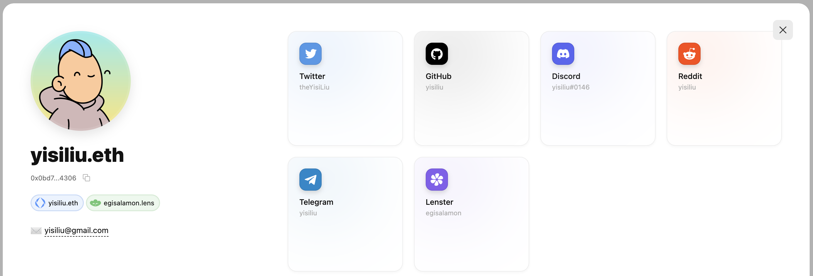

Next.ID is a decentralized identity (DID) creation and management protocol built for developers. The Next ID protocol is used as the secure connecting fiber between different web2 and web3 identifiers, such as wallets, twitter profiles, ENS names, Lens profiles, and many more.
By connecting a person’s different identifiers together, they form an identity graph - a powerful, portable, sovereign (self-owned) digital identities. Next ID refers to these identities, digital representations of self, as avatars.

We provide services for creating DIDs, querying existing relationships, attaching data payloads to DIDs.

- Don’t know what DIDs are? —> [Video explainer link](https://www.youtube.com/watch?v=zaYYQLDnS6s&t=12s)

## Sovereign Identity Graphs
An identity graph is the network of a user’s identifiers (addresses, social profiles, etc.). Using secure key pair (Avatar) signatures, entities are bonded to an address.

How two users' Avatars may interact:

Next.ID creates an identity infrastructure that securely aggregates users’ identities into Avatars, making it the primary touch point for interfacing with any app or dApp. For example, this is how it can look like on a decentralized social network:

## Universal Profile API - One API for all web3 profiles
Identity graphs consist of identifiers, like twitter, reddit, or github handles. These are used to build Universal Profiles for users. Developers, using the Universal Profile SDK import information-rich user profiles, decreasing onboarding time and enabling instant personalization.

[Universal Profile](https://api.web3.bio)

### Identity + data
Next.ID’s KVService functions as a data backpack. Fundamentally, it is a way to attach a payload (data) to an Avatar/ID graph. For example, a social graph of follows/followers can be appended to a DID, enabling simple portability, making the data travel wherever the user goes.

### Data integrity
DIDs are created and modified using a cryptographically secured private-public key pairing (Avatar) system. This ensures every change and its history are only made by users with the right private keys.

Every change and its history are publicly available and verifiable on Arweave, following Next ID’s commitment to decentralization and transparency.
