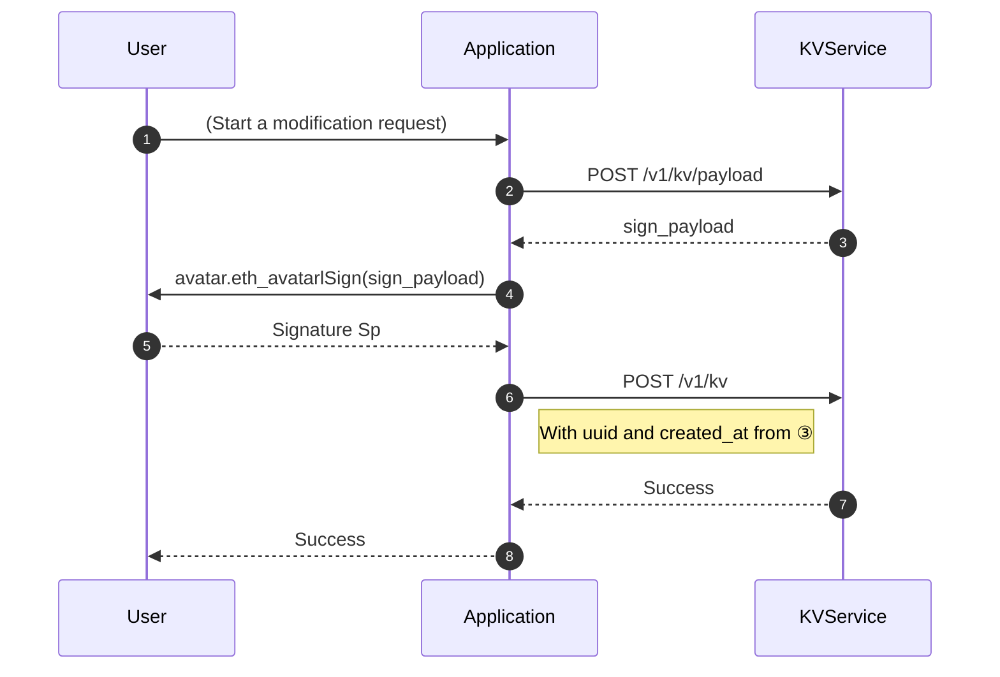

KVService is designed to save/read user data in a traceable and
decentralized way.

## Feature

### Free data structure

KVService can store any valid `JSON` `object` data.

### Verifiable records

KVService use the same design of
[ProofService](/proof-service/intro.md)'s [signature
chain](/proof-service/glossary.md#glossary-proof-chain) to ensure:

- Traceable: all changes are approved by user and cannot be falsified
  by third parties.
- Decentralized: The user has the full right to dispose the data.

:::caution WIP

KVService will provide API for signature chain export. Anyone can
verify each changes, and restore the final data status.

:::

## Brief of design

- Each user has `1 + N` namespaces：
  - [Avatar](/proof-service/glossary.md#glossary-avatar) itself has a namespace (`platform == "nextid" && identity == "0xAVATAR_PUBLIC_KEY"`)
    - There's no limitation that [Avatar](/proof-service/glossary.md#glossary-avatar) should be used in [ProofService](/proof-service/intro.md) once.
  - Each [binding record](/proof-service/glossary.md#glossary-link) (in [ProofService](/proof-service/intro.md)) of each [Avatar](/proof-service/glossary.md#glossary-avatar) has a namespace.
    - Value of `platform` and `identity` are the same as [definition](/proof-service/platforms.md) in ProofService.
- [Query data](kv-api#query): public, only need to specify `avatar`.
- [Write data](kv-api#payload): A patch followed [RFC 7396](https://www.rfc-editor.org/rfc/rfc7396) standard.

  <details>
  <summary>A glimpse of RFC7396</summary>

  ```js
  // Assume current data is:
  {
    "a": {
      "b": [2, 3, 4, "test"]
    },
    "c": "Hello"
  }

  // If this patch is submitted:
  { "a": { "b": null, "new_key": true }, "c": "KVService" }

  // Then patched data will become:
  {
    "a": {
      "new_key": true
    },
    "c": "KVService"
  }
  // Notice: nested modification of Array value is not supported.
  //         Replace the whole Array with new value instead.
  ```
  </details>

## Use case

- Web3 apps need to save user configurations
  > e.g. profile (name, avatar link, bio, etc.), NFT showcase (hide/show, order, etc.) or wallet address priority.

## Workflow

### Write data



> APIs mentioned:
>
> - [POST /v1/kv/payload](/rest-api/kvservice-api#payload)
> - [POST /v1/kv](/rest-api/kvservice-api#patch)

### Query data

See [GET /v1/kv](/rest-api/kvservice-api#query).

## Conventions

- Each app should use their "package name" as their own namespace, to ensure other apps are not infected by your modification.
  > For example, I as a developer, identify my app as `io.mask.web3-profile-plugin`,
  >
  > Then I should make all my modification under `{ "io.mask.web3-profile-plugin": .... }` key.

- Theoretically, there is no size limitation for data. FairUse™️, please.
  > If you want to store data bigger than a string can handle, consider [Arweave](https://www.arweave.org).
