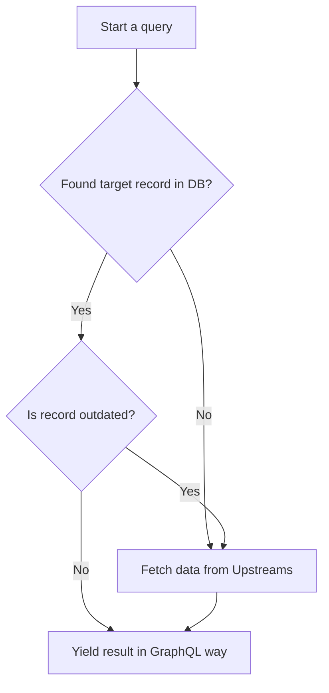

## Flow

### Processing a query



### Fetch data from [Upstream](rs-intro#upstreams)s

When performing a data fetching process, RelationService will

1. Iter all available upstreams which can handle this query
2. Request and collect results from each upstream available
3. Newly fetched data will be fed into this circulation again, until no new data is yield.

A pseudo code snippet describing this:

```ruby
up_next = [{platform: :platform_to_query, identity: "identity_to_query"}]
fetched = []

until up_next.empty? do
  processing = up_next.pop()
  results = fetch_one(processing)
  fetched.push(processing)
  results.each do |result|
    next if up_next.contains?(result) || fetched.contains?(result)
    up_next.push(result)
  end
end

# Query all available upstream for connections of given identity.
def fetch_one(identity)
  all_upstreams.map do |upstream|
    upstream.can_handle?(identity) ? upstream.perform_query(identity) : []
  end.flatten()
end
```

> Actual code can be found at
> [src/upstream/mod.rs](https://github.com/nextdotid/relation_server/blob/develop/src/upstream/mod.rs)
> -> `pub async fn fetch_all()` definition

So you may found a "code search" kind of slow in the first time, but
when it is fetched and cached in RelationService DB, second query will
become pretty fast.

## See also

- [GraphQL](rs-graphql) usage
