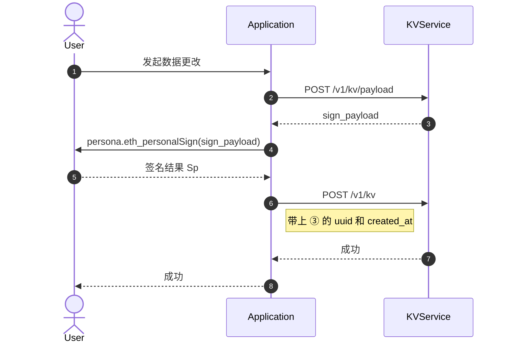

KVService 旨在可追溯、去中心化地保存 / 读取用户数据。

## 特色

### 数据结构自由

可存储任何合法的 `JSON` `object` 结构。

### 可验证的记录

KVService 使用与 [ProofService](/proof-service/intro.md)
相同的[签名链](/proof-service/glossary.md#glossary-proof-chain)设计，以保证：

- 可追溯：改动记录均被用户批准，无法被第三方伪造
- 去中心化：用户拥有数据的完整处置权

:::caution WIP
未来会公开签名链导出的 API，所有使用者都可验证每一次改动的合法性，并自己还原最终存储状态。
:::

## 设计简述

- 每个用户拥有 N + 1 个名字空间：
  - [Persona](/proof-service/glossary.md#glossary-persona) 自己有一个名字空间（`platform == "nextid" && identity == "0xPERSONA_PUBLIC_KEY"`）
    - 不限定该 [Persona](/proof-service/glossary.md#glossary-persona) 在 [ProofService](/proof-service/intro.md) 中有过使用记录。
  - 该 [Persona](/proof-service/glossary.md#glossary-persona) 在 [ProofService](/proof-service/intro.md) 下绑定的每条记录均有一个名字空间（`platform` 与 `identity` 定义与 ProofService [对应](/proof-service/platforms.md)）
- [读数据](kv-api#query)：完全公开，只要指定对方的 `persona` 。
- [写数据](kv-api#payload)：遵守 [RFC 7396](https://www.rfc-editor.org/rfc/rfc7396) 标准的 Patch。

  <details>
  <summary>一个简单的例子</summary>

  ```js
  // 假设已有的数据为
  {
    "a": {
      "b": [2, 3, 4, "test"]
    },
    "c": "Hello"
  }
  // 若提交如下更改请求
  { "a": { "b": null, "new_key": true }, "c": "KVService" }
  // 那么数据会变成
  {
    "a": {
      "new_key": true
    },
    "c": "KVService"
  }
  // 注意：不支持 Nested 地修改 Array 内部，只支持替换
  ```
  </details>

## 典型使用场景

- Web3 的 App 需要保存用户的自定义设置，如个人资料、NFT 的展示顺序、钱包优先级等。

## 使用流程

### 写数据



> 使用的 API：
>
> - [POST /v1/kv/payload](kv-api#payload)
> - [POST /v1/kv](kv-api#patch)

### 读数据

参照 [GET /v1/kv](kv-api#query)

## 约定

- 每个 App 使用自己的“包名”来当作自己的名字空间，以此保证你的 App 的数据不会影响其它 App 的数据。
  > 比如我开发的 App 是 `io.mask.web3-profile-plugin`，
  >
  > 那么我应保证我只使用 `{ "io.mask.web3-profile-plugin": .... }`
- 原则上，数据大小不设限制。请合理使用。若有存储大型数据的需求，请考虑 [Arweave](https://www.arweave.org)。
