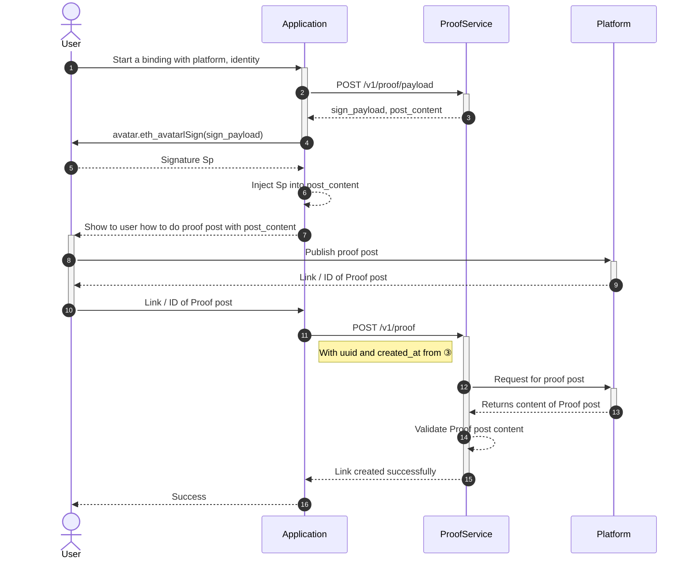
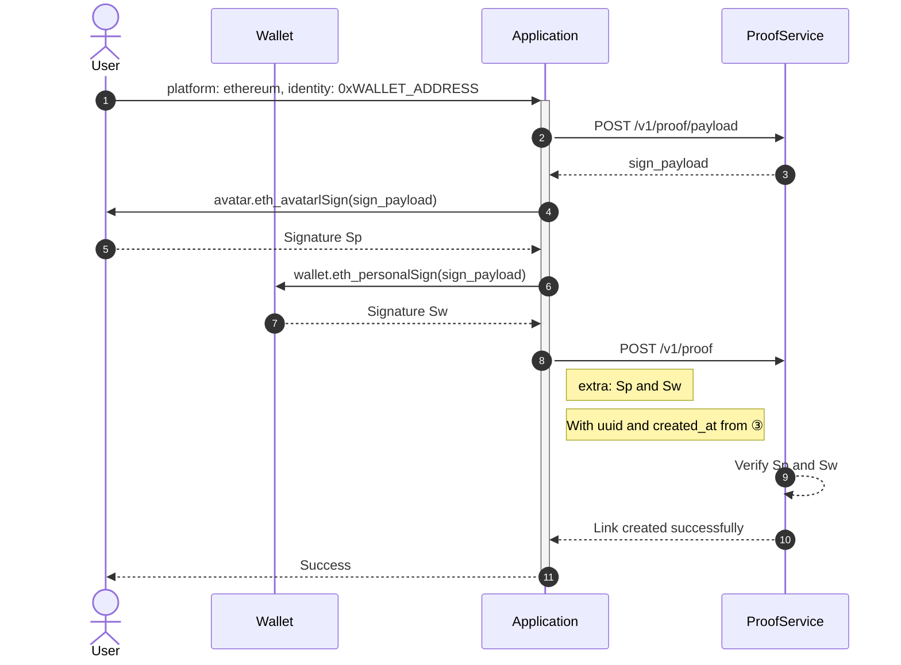
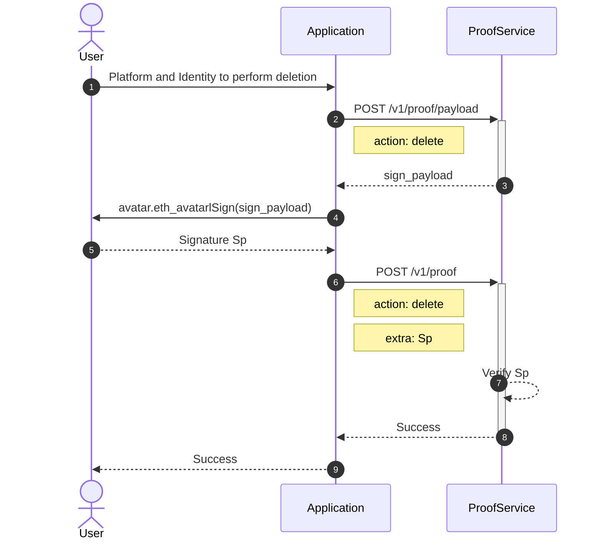

# Flow of typical scenario

> Use this with [Glossary](ps-glossary)

## Create a [Link](ps-glossary#glossary-link) {#create}

See also

- [POST /v1/proof/payload](api#proof-payload)
- [POST /v1/proof](api#proof-add)

### Create an Ethereum Link {#ethereum}

> This procedure is for `platform == "ethereum"`.

See also

- [POST /v1/proof/payload](api#proof-payload)
- [POST /v1/proof](api#proof-add)
- `identity` wallet address matches `0x[0-9a-f]{40}`。
- No need to publish this sigature somewhere, because:
  - The ability of generating this sig is equals to the ownership of secret key.
  - No one can falsify it, except the secret key owner.

## Delete a link

Link deletion is also a link.

See also

- Application can guide user to delete [Proof post](ps-glossary#glossary-proof-post) on specific platform (if any) later.

## Query

Check [GET /v1/proof](api#proof-query).
