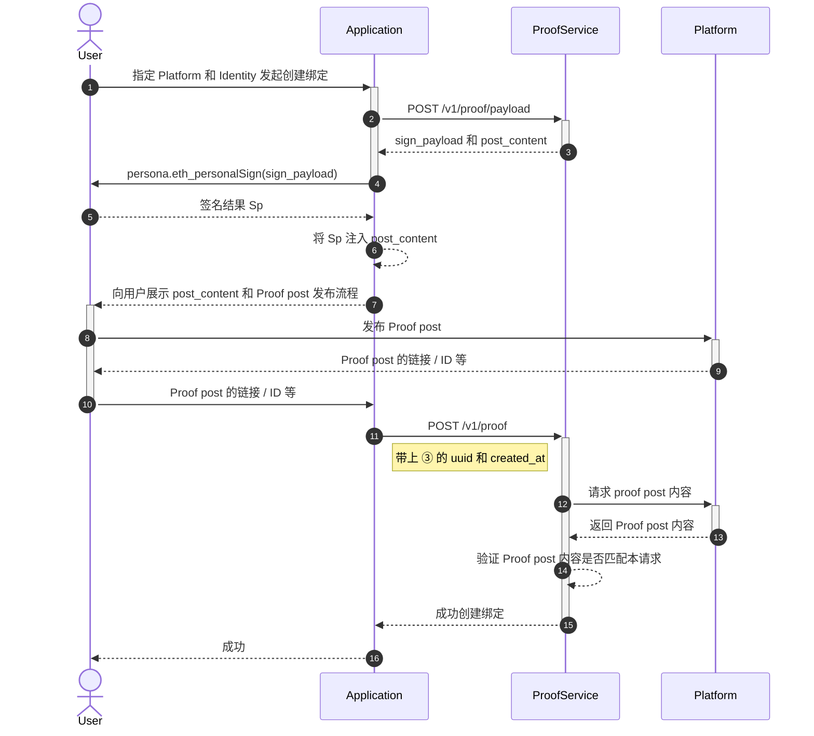
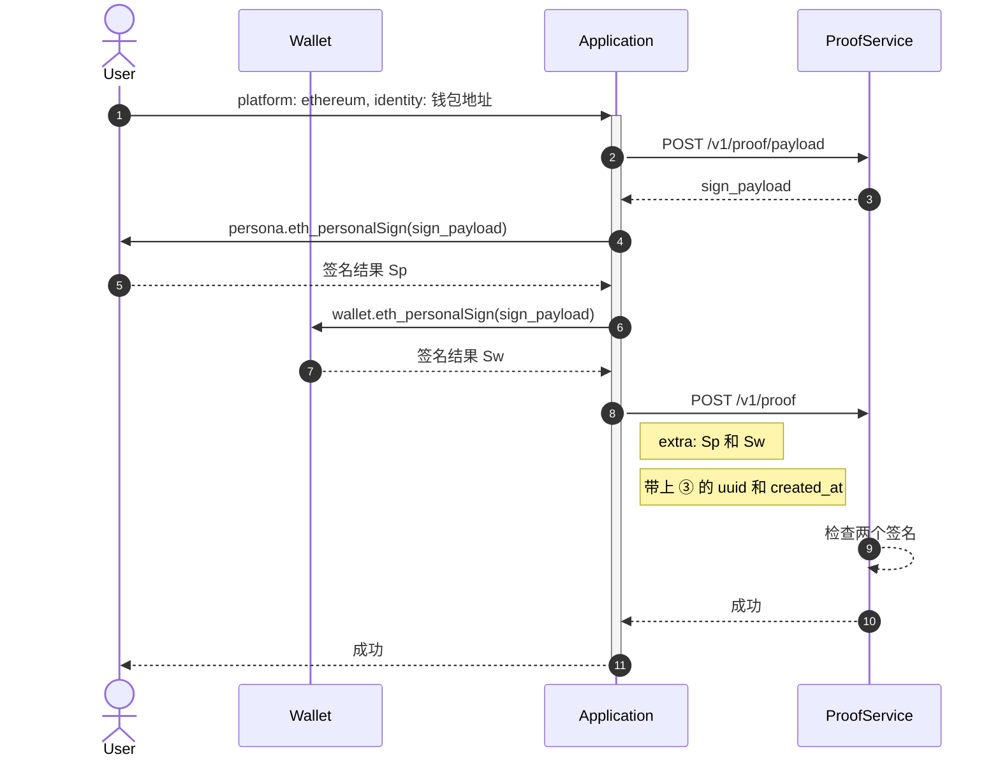
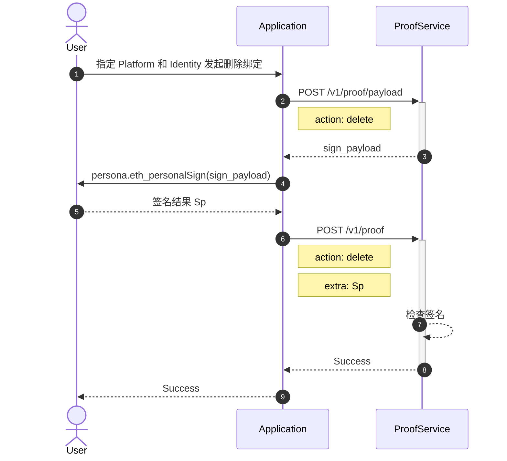

# 流程

> 请搭配 [名词表](ps-glossary)

## 创建绑定 {#create}

补充

- [POST /v1/proof/payload](api#proof-payload)
- [POST /v1/proof](api#proof-add)

### 创建（以太坊） {#ethereum}

> 当 `platform == "ethereum"` 时使用此流程。

补充

- [POST /v1/proof/payload](api#proof-payload)
- [POST /v1/proof](api#proof-add)
- `identity` 固定是钱包地址 `0x[0-9a-f]{40}`。
- 不需要将签名发表到什么公开平台上，因为
  - 服务器无法伪造它
  - 用户能生成签名，也就意味着用户拥有这个私钥

## 删除身份绑定

补充

- Application 可事后引导用户在对应 platform 里删除 proof post。

## 查询

请直接查看 [GET /v1/proof](api#proof-query) 文档。
