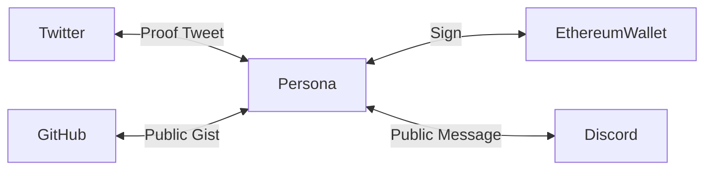

# 名词表

## Persona {#glossary-persona}

Persona 为 ProofService 系统内用户身份网络的中心。

其它 [Identity](#glossary-identity)（Web2.0 身份、区块链钱包等）**只**
与 Persona 产生绑定关系。

> 目前 Persona 的形态为使用 `secp256k1` 椭圆曲线的公私钥对，并主要使用其签名 / 验签的功能。



## Identity {#glossary-identity}

和 [Persona](#glossary-persona) 产生绑定关系的其它
[Platform](#glossary-platform) 上的身份。

如 Twitter 为形如 `@my_twitter` 的账号，GitHub 为 `my_github` 用户等。

> 详请参阅 [目前支持的 Platform 列表](ps-platforms-supported)

## Platform {#glossary-platform}

[Identity](#glossary-identity) 所处的身份提供商，如 Twitter、GitHub、
Facebook、Ethereum 等。

> 详请参阅 [目前支持的 Platform 列表](ps-platforms-supported)

## Proof post {#glossary-proof-post}

为证明 “我拥有此 [Identity](#glossary-identity)” ，需要让用户做出一个行为：用此 [Identity](#glossary-identity) 发布一条公开可见的指定内容。该“指定内容”即为 Proof post。

比如 Platform 为 Twitter 时就是一条公开可见的推文，Platform 为 Github 时则是一个公开可见的 Gist。

> Proof post 在不同平台上的型态不同。详请参阅 [目前支持的 Platform 列表](ps-platforms-supported)。

:::tip 如果 [Identity](#glossary-identity) 为密码学身份
密码学身份（如区块链钱包）的绑定不需要 proof post。因为生成签名这个动作已足以证明用户拥有钱包。
:::

:::caution 如果 Proof post 事后被用户删除
参阅 [降级](#glossary-downgrade)。
:::

## 绑定关系 Link {#glossary-link}

当 ProofService 服务端验证了 [Proof post](#glossary-proof-post) 的有效性后，一条 “[Persona](#glossary-persona) <->
[Identity](#glossary-identity) ” 的绑定关系便会被固化在
[Proof Chain](#glossary-proof-chain) 里。

<details>
<summary>Link 的结构定义 </summary>

> 仅作为 Link 概念的感性认知，不代表 ProofService 内部实现或 API 结构。

```typescript title="link.d.ts"
// assert(signature.match(/0x[a-f0-9]{144}/))
// Sample:
// 0x3046022100881328457aa312135c37e1ddf8a129717274ce3f389c176936f5cb44edf04fc4022100be183139154d108ce2e5d6ba16678b0dbeb3b7d70caac2b00b2dad8f81e87790
type Signature = string;

// All available chain modification actions
enum Action {
    Create = "create",
    Delete = "delete",
}

// All supported platforms,
enum Platform {
    Twitter = "twitter",
    Keybase = "keybase",
}

// Each link in the proof chain
interface Link {
    // If this is genesis link, leave it null; else, it equals
    // previous link's signature. Worked as a pointer.
    prev: Signature | null;
    action: Action;
    platform: Platform;
    identity: string;
    // if method === Method.Add, then it must be a string; else, left null
    proof_location: string | null;
    // UNIX timestamp (unit: second)
    created_at: number;
    // An UUID of this link, works as a global identifier.
    uuid: string;
    // Signature of this link made by persona.
    signature: Signature;
}
```

</details>

## 证明链 Proof Chain {#glossary-proof-chain}

每个 [Persona](#glossary-persona) 在 ProofService 服务端里的绑定更改记录被体现为一个签名链：

- 每一个 [Link](#glossary-link) 都有 [Persona](#glossary-persona) 的签名。
- 除第一个 [Link](#glossary-link) （创世 Link）外，每一个 [Link](#glossary-link) 签名所用的 payload 都包含上一条 [Link](#glossary-link) 的签名。

由此机制保证 ProofService 服务端无法修改链中任何一条记录。

> 目前的存储方式不影响证明效力。未来为减少单点故障的可能，会将证明链在 Arweave 或 IPFS 上做备份。

:::caution TBD
未来可以通过一个 API 向 ProofService 索取任一 Persona 的完整的 Proof chain。
:::

<details>
<summary>Proof Chain 的结构定义</summary>

> 仅作为 Proof Chain 概念的感性认知，不代表 ProofService 内部实现或 API 结构。

```typescript title="chain.d.ts"
const VERSION = "1";

// assert(public_key.match(/^0x[a-f0-9]{130}$/))
// Sample:
// 0x0428b73a2b67a88a47edb15bed5c73a199e24287bb12997c54239e9e6815e24a3032a502d58afe3f36a54f2f7606022907f358d0dd58939cffa0a845c5043ce038
type PublicKey = string;

interface Chain {
    version: VERSION;
    persona: {
        public_key: PublicKey,
        curve: "secp256k1",
    };
    // See definition of `Link` above.
    links: Link[];
}
```

</details>


## 降级 {#glossary-downgrade}

:::caution WIP
👷‍♀️👷 此功能正在施工中，尚未上线。
:::

服务端会定期检查 [Proof post](#glossary-proof-post) 的有效性。

若在某次检查时 [Proof post](#glossary-proof-post) 无效了（获取不到 / 签名错误等），该证明会在[查询 API](api#proof-query) 中被标记为 `"is_valid": false` 并附上当时检查器的错误原因。

> 例如，用户在绑定了 Twitter 账号后的某一天把证明推删除了，但没有告知 ProofService 解绑此关系。

> 即使降级了，ProofService 依然不会（也无法）对[证明链](#glossary-proof-chain)作任何改动，仅在[查询 API](api#proof-query) 中返回 `"is_valid": false` 。

如何处理降级的绑定查询结果由使用者决定。
